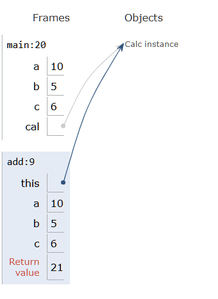

# Core Java

## Object - Oriented Programming

### Java Class

- The class contains methods and variables


```java
class Calc{

    public int add(int a, int b) {
        System.out.println("in add");
        return a+b;
    }
}

Calc c = new Calc();
int res = c.add(a,b);

System.out.println(res);
```

________


## JDK - JRE - JVM

- JDK --> JRE --> JVM

- We write and edit the code in the JDK
- We compile the code in the JRE
- We execute the code in the JVM

_____________


## Method Overloading

- If we need a function to add two nums or three nums?

- For this we could have same method name but with different parameters

- We need to have same return type and method name.

```java
class Calc{


    public int add(int a, int b) {
        return a+b;
    }

    public int add(int a, int b, int c) {
        return a+b+c;
    }
}
```
_________________


## Stack and Heap

- The data is stored in JVM in form of stack or heap


### Stack

- The memory is stored in form of stack - > Last In First Out -> LIFO

- Every method will have its own stack memory


### Heap

- The memory is stored in random form -> 


### Memory as we compile the code

- The Main creates a stack

- The local variables are stored in stack

- The instance ref is stored in the stack

|Stack | Data|
|------|-----|
|main: |20   |
|a	   |10   |
|b	   |5    |
|c	   |6    |
|cal   |ref  |


- The Object/instance with the variable or methods are stored in the heap


cal - Obj<br\>
(  num | 5  )<br\>
(-----------)<br\>
( add() --- )<br\>


Eg:

```java
class Calc{


    public int add(int a, int b) {
        return a+b;
    }

    public int add(int a, int b, int c) {
        return a+b+c;
    }
}

public class Demo {
    public static void main(String[] args){
        int a = 10;
        int b = 5;
        int c = 6;

        Calc cal = new Calc();
        int res = cal.add(a,b,c);

        System.out.println(res);

    }
}
```

Memory Visualized:




___________________


## Arrays

- To save index based elements in order


```java
int nums[] = {3,7,2,4};


int nums2[] = new int[4]; // default values of zeroes
```

### Multi-Dimensional Arrays

- Uniformed array with every row of same length

```java
int mat[][] = {{1,2,3}, {4,5,6}, {6,7,8}};

int mat2[][] = new int[3][3];
```

_______________


### Jagged Array

- Random size row array with every row of different length


```java
int mat[][] = new int[3][];

mat[0] = new int[3];
mat[1] = new int[4];
mat[2] = new int[2];


for (int i = 0; i < mat.length;i++){

    for (int j = 0; j< mat[i].length; j++){

        mat[i][j] = (int) (Math.random() *100); 
    }
}

for (int m[]: mat ){

    for (int i : m){

        System.err.print(i + " ");
    }
    System.err.println();
}

System.err.println();
System.out.println(mat[2][1]);
```


### Array Objects

- To have a array of objects 

```java
class Student{

    int rollno;
    String name;
    int marks;


    Student (int rollno, String name, int marks){
        this.rollno = rollno;
        this.name = name;
        this.marks = marks;
    }

}

public class Demo {
    public static void main(String[] args){

        Student s1 = new Student(1, "Bhuvan",69);
        Student s2 = new Student(2, "Pandu",96);
        Student s3 = new Student(3, "Bngrm",78);

        Student students[] = new Student[3];
        students[0] = s1;
        students[1] = s2;
        students[2] = s3;

        System.out.println(students[1].name);
    }
}
```

____________


## String


- String is non-primitive data type

- String is a class based

```java
String name = new String("Bhuvan");

String name = "Bhuvan";
```

### String Methods

- To concat -> str.concat(str2) -> str + str2
- To find char at a index -> str.charAt(index) 
- To get the length of the str -> str.length()


### String Buffer vs String Builder

- String Buffer are Thread safe
- String Builder are not Thread safe
- We have many methods which are specific to String Builder or Buffer
    - .append()
    - .insert()
    - .setLength()


### Immutable

- The string is immutable
- String is saved in Heap of String constant pool

- This means if there are two strings with same string that means both the strings are refering to the same string the heap

- If s1 = "Bhuvan" & s2 = "Thota"

|String|Data|
|------|----|
|s1    |110 |
|s2    |120 |


- If s1 = "Bhuvan" & s2 = "Bhuvan"

|String|Data|
|------|----|
|s1    |110 |
|s2    |110 |


#### To check the immutable and mutablity of the string in java

```java
String str1 = "ABC";

System.out.println(str1);
System.out.println(str1.hashCode());

str1 = str1.replace('A', 'B');
System.out.println(str1);
System.out.println(str1.hashCode());

/////////////////

StringBuilder str2 = new StringBuilder("BBBBBC");

System.out.println(str2);
System.out.println(str2.hashCode());

str2 = str2.replace(0,1,"A");
System.out.println(str2);
System.out.println(str2.hashCode());
```

- Output: 
ABC
64578
BBC
65539
BBBBBC
798154996
ABBBBC
798154996

________________________


